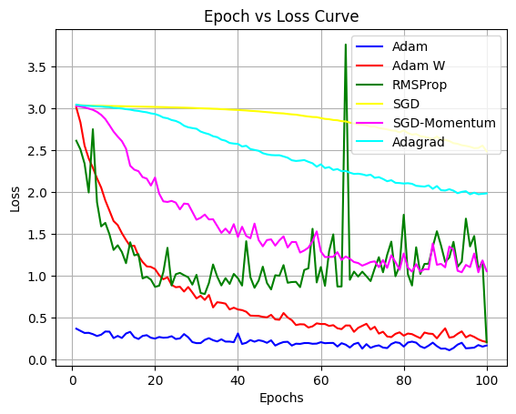

# Assignment 4

## Neha Shahu (24M2159) Sameer Anand Jha (24M1062)

### Objective: 

##### Comparison of Epochs v/s Loss Curve for various optimizers for the given CNN and the task.

### Observations

##### Tried the experiment for 6 optimizers. Adam performed arguably better than the rest. The setup was fixed at 100 epochs and UC Merced Dataset was Used.

